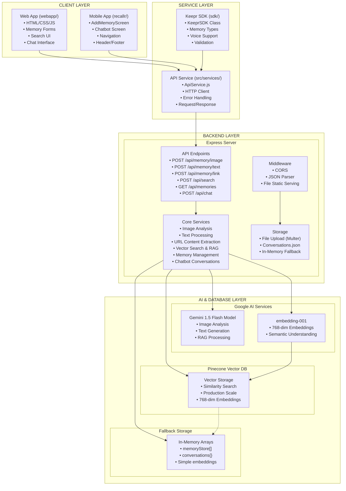
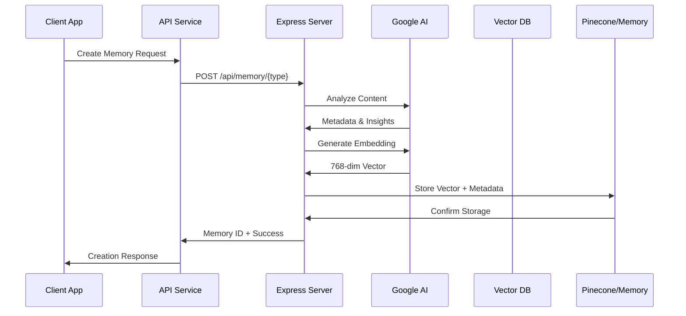
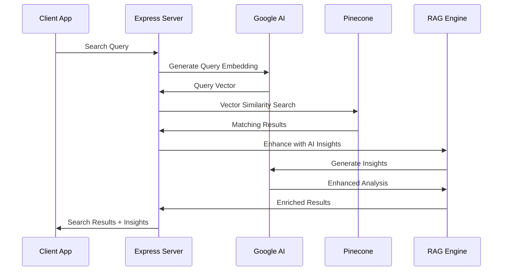
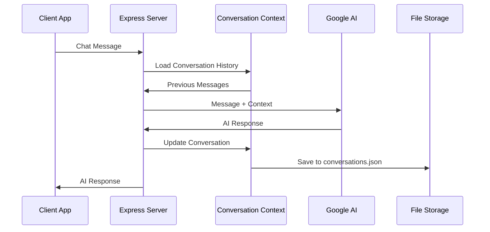
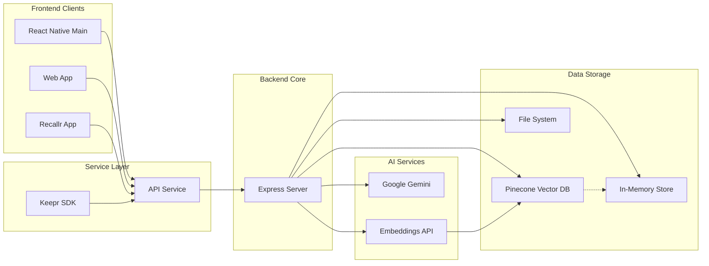
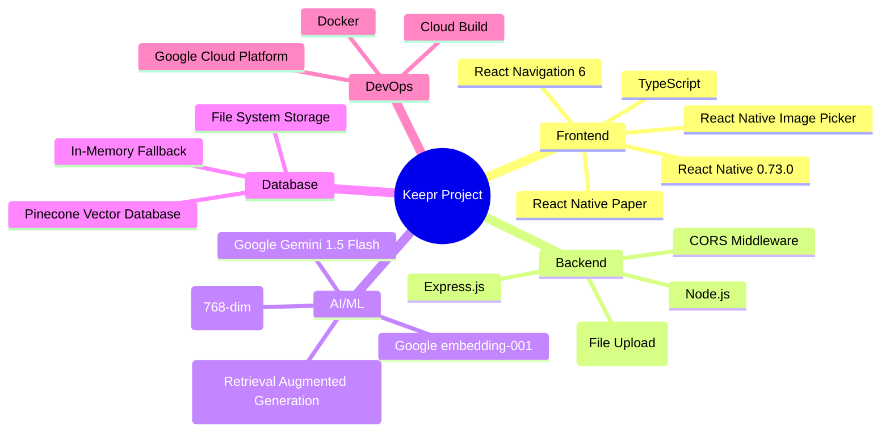

# Keepr Project - High-Level Architecture Diagram

## Overview
Keepr is a multi-platform AI-powered memory management application with vector database integration for semantic search and RAG (Retrieval Augmented Generation) capabilities.

## Component Architecture

## Data Flow Diagrams

### 1. Memory Creation Flow

### 2. Search Flow

### 3. Chat Flow

## Component Interaction Map

## Technology Stack Overview

## Key Components Breakdown

### Frontend Applications
- **Main React Native App**: Primary mobile interface with navigation, memory management, and search
- **Web App**: Browser-based interface for memory management and chat
- **Recallr App**: Alternative React Native implementation with enhanced UI/UX

### Service Layer
- **Keepr SDK**: Reusable TypeScript SDK with voice support and type definitions
- **API Service**: HTTP client abstraction for frontend-backend communication

### Backend Services
- **Express Server**: Central API hub handling all business logic
- **Memory Analysis**: AI-powered content understanding and metadata extraction
- **Vector Search**: Semantic search with RAG enhancement
- **Chat System**: Conversational AI with context management

### External Services
- **Google AI Platform**: Content analysis, embeddings, and text generation
- **Pinecone**: Production vector database for semantic search
- **File Storage**: Local file system for image uploads

## Architecture Benefits

1. **Modular Design**: Clear separation of concerns between layers
2. **Multi-Platform**: Support for web, mobile, and SDK integration
3. **AI-First**: Semantic search and RAG capabilities throughout
4. **Scalable**: Vector database for production workloads
5. **Resilient**: Fallback storage for offline/development scenarios
6. **Extensible**: SDK allows third-party integration 